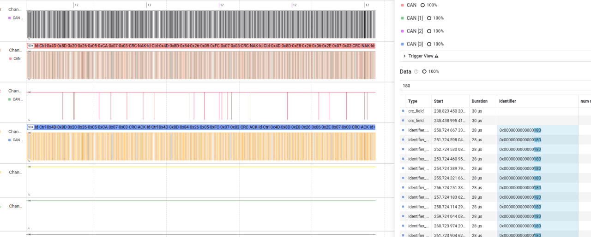
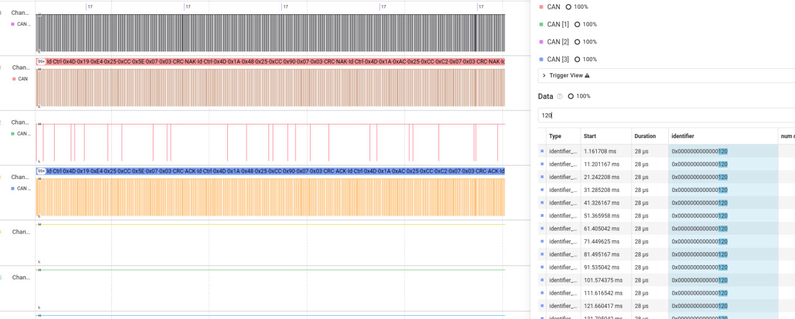
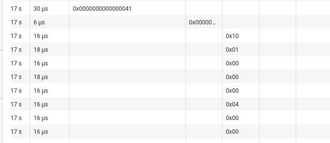
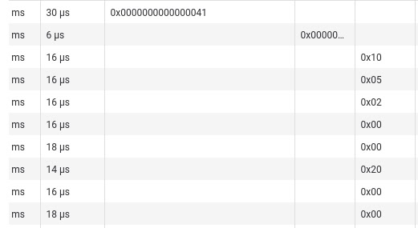
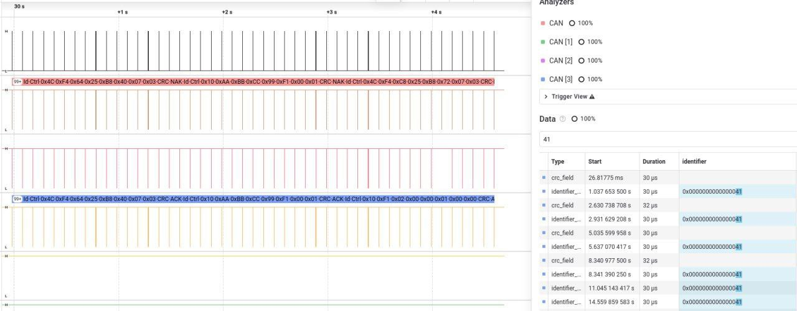
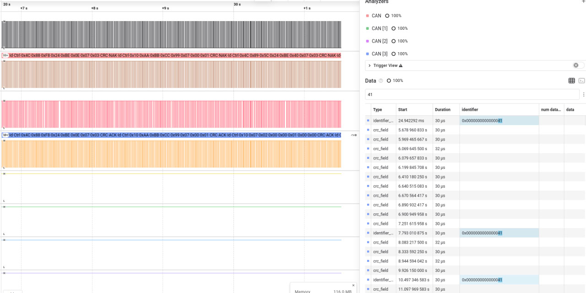

# Lab: CAN — Hardware Filters & Node Interaction

> **Title:** Lab: CAN  
> **Developers:** Mariia Ivanchenko,  Oleksandr Ivaniuk, Anastasiia Pelekh

This repository documents a 3-node CAN bus setup built on STM32 microcontrollers.  
The network demonstrates:

- Classic CAN multi-master communication at 500 kbit/s.
- Periodic telemetry from **real GPS** and **environmental sensors**.
- Heartbeat monitoring for all nodes.
- A command/ACK protocol with **application-level protection** (token + CRC8 + version + sequence).
- **Hardware receive filters (whitelist)** on the controller node.
- “Red-team” style **injection / spoofing** and **DoS-light** tests, plus mitigation.

---

## 1. Hardware Overview

### 1.1 Nodes

- **Node A — GPS/Status (NUCLEO-F446RE)**  
  - Reads position and status from a GPS module.  
  - Publishes **fast telemetry** (position / satellites / fix) on the CAN bus.  
  - Sends a periodic heartbeat frame.  
  - Generates control commands toward Node C.

- **Node B — Environment (Bluepill STM32F103C6T6A)**  
  - Reads real environmental data from temperature/pressure/humidity/light sensors.  
  - Publishes **slow telemetry** with environment values.  
  - Sends its own heartbeat.

- **Node C — Controller / Watchdog (NUCLEO-F446RE)**  
  - Receives and validates commands from the bus.  
  - Uses hardware filters to accept **only**:
    - Command frames `0x040`.
    - Heartbeats `0x081` and `0x082`.
  - Validates commands with Token + CRC8 + Version + Sequence.  
  - Sends back ACK/ERR frames `0x041`.  
  - Signals activity and errors using an on-board LED (LD2).

### 1.2 CAN Physical Layer

- **Transceivers:** SN65HVD230 / TJA1050 (3.3 V variants).
- **Bus topology:**  
  - A single linear bus (CANH/CANL) with **two 120 Ω termination resistors at the ends**.
  - Short stubs from each node to the main trunk.
  - Common ground shared between all three nodes and the logic analyzer.

### CAN NETWORK WIRING DIAGRAM
                            [ 120 Ω TERMINATOR ]
                              ┌────────────────┐
                              │  Between CANH  │
                              │     and CANL   │
                              └────────────────┘
                                       │
                                       │
                                     CAN BUS
                                       │
                                       │
                               ┌──────────────┐
                               │    Node A    │
                               │ NUCLEO-F446RE│
                               └──────────────┘
                                   MCU ↔ Transceiver A
                                   --------------------
                                   3V3  ─────────→ VCC
                                   GND  ─────────→ GND
                                   CAN1_TX (PB9/PA12) ─→ TXD/D
                                   CAN1_RX (PB8/PA11) ─→ RXD/R
                                   STB/RS ───────→ GND (normal mode)

                                   Transceiver A ↔ CAN Bus
                                   -----------------------
                                   CANH ────────────────┐
                                   CANL ────────────────┘
                                   (One 120Ω terminator here)

                                   Optional Sensors (GPS)
                                   -----------------------
                                   GPS VCC ─────────→ 3V3/5V
                                   GPS GND ─────────→ GND
                                   GPS TX  ─────────→ PA3 (USART RX)
                                   GPS RX  ─────────→ PA2 (USART TX)

                                       │
                                       │  (shared CANH/CANL + shared GND)
                                       ▼

                               ┌──────────────┐
                               │    Node B    │
                               │ Bluepill F103│
                               └──────────────┘
                                   MCU ↔ Transceiver B
                                   --------------------
                                   3V3  ─────────→ VCC
                                   GND  ─────────→ GND
                                   PA12 (CAN_TX) ─→ TXD/D
                                   PA11 (CAN_RX) ─→ RXD/R
                                   STB/RS ───────→ GND

                                   Transceiver B ↔ CAN Bus
                                   -----------------------
                                   CANH ────────────────┐
                                   CANL ────────────────┘
                                   (NO terminator here)

                                   Optional Sensors (Env)
                                   -----------------------
                                   I2C_SCL (PB6) ─→ SCL (BME280)
                                   I2C_SDA (PB7) ─→ SDA (BME280)
                                   LDR Divider ─→ ADC Pin (e.g., PA0)

                                       │
                                       │  (shared CANH/CANL + shared GND)
                                       ▼

                               ┌──────────────┐
                               │    Node C    │
                               │ NUCLEO-F446RE│
                               └──────────────┘
                                   MCU ↔ Transceiver C
                                   --------------------
                                   3V3  ─────────→ VCC
                                   GND  ─────────→ GND
                                   CAN1_TX (PB9/PA12) ─→ TXD/D
                                   CAN1_RX (PB8/PA11) ─→ RXD/R
                                   STB/RS ───────→ GND

                                   Transceiver C ↔ CAN Bus
                                   -----------------------
                                   CANH ────────────────┐
                                   CANL ────────────────┘
                                   (Second 120Ω terminator here)

                                   Status LED
                                   ----------
                                   PA5 → On-board LD2 (blinks on commands/HB)

### Logic Analyzer (Optional Connections)

 LA GND  -> Shared GND
 LA CH0  -> Node B TX 
 LA CH1  -> Node A TX 
 LA CH2  -> Node C TX 
 LA CH3  -> Node A RX 

 Decoder Settings:
   - Protocol: CAN
   - Speed: 500000 bit/s
   - ID: Standard (11-bit)

---

## 2. CAN Configuration and ID Map

### 2.1 Bit Timing

- Bitrate: **500 kbit/s** (classic CAN, 11-bit IDs).
- Sample point ≈ **80%**.
- Example configuration (F4 @ APB1 45 MHz, bxCAN):
  - Prescaler = 6
  - BS1 = 11 Tq
  - BS2 = 3 Tq
  - SJW = 1 Tq

All three nodes use the **same bit timing**, so they can arbitrate correctly and acknowledge each other’s frames.

### 2.2 CAN Message IDs

| Node | Purpose                | ID (hex) | Direction | Period / Trigger      |
|------|------------------------|----------|-----------|-----------------------|
| A    | GPS fast telemetry     | `0x120`  | TX       | 10 Hz (every 100 ms)  |
| A    | Heartbeat (Node A)     | `0x081`  | TX       | 1 Hz (every 1000 ms)  |
| A    | Command to controller  | `0x040`  | TX       | Event-driven (e.g. 2.7–3 s) |
| B    | Env slow telemetry     | `0x180`  | TX       | 1 Hz (every 1000 ms)  |
| B    | Heartbeat (Node B)     | `0x082`  | TX       | 1 Hz (every 1000 ms)  |
| C    | ACK/ERR for commands   | `0x041`  | TX       | On each received `0x040` |
| All  | Heartbeat policy       | `0x080 + NodeID` | TX | 1 Hz (here: `0x081` / `0x082`) |

> Rule: **Lower ID = higher priority**.  
> Commands (`0x040`) and ACK/ERR (`0x041`) have higher priority than telemetry (`0x120`, `0x180`).

---

## 3. Data Formats

### 3.1 Fast GPS Telemetry — ID `0x120` (Node A → bus)

8-byte payload:

| Byte | Field              | Description                               |
|------|--------------------|-------------------------------------------|
| 0    | `lat[23:16]`       | Latitude, signed 24-bit, scaled by 1e-5   |
| 1    | `lat[15:8]`        |                                           |
| 2    | `lat[7:0]`         |                                           |
| 3    | `lon[23:16]`       | Longitude, signed 24-bit, scaled by 1e-5  |
| 4    | `lon[15:8]`        |                                           |
| 5    | `lon[7:0]`         |                                           |
| 6    | `sats`             | Number of satellites in view / used       |
| 7    | `fix/hdop`         | Fix status, HDOP category, etc.           |

Values come from the GPS module and are updated at 10 Hz.

---

### 3.2 Slow Environment Telemetry — ID `0x180` (Node B → bus)

8-byte payload (fixed-point formats):

| Byte | Field     | Format       | Description                     |
|------|-----------|--------------|---------------------------------|
| 0–1  | Temp      | Q9.7         | Temperature in °C               |
| 2–3  | Pressure  | Q13.3        | Pressure in hPa or Pa/1000      |
| 4    | RH        | `% * 2`      | Relative humidity (0–200 → 0–100 %) |
| 5–6  | Lux       | uint16       | Light intensity (lux)           |
| 7    | Reserved  |              | Future use / flags              |

Values are sampled from real temperature, pressure/humidity, and light sensors at ~1 Hz.

---

### 3.3 Command Frame — ID `0x040` (Node A → Node C)

8-byte payload:

| Byte | Field   | Description                                                 |
|------|---------|-------------------------------------------------------------|
| 0    | CmdID   | Command ID (e.g. “ARM”, “SET MODE”, “RESET”, etc.)         |
| 1    | Arg0    | Command argument 0                                         |
| 2    | Arg1    | Command argument 1                                         |
| 3    | Arg2    | Command argument 2                                         |
| 4    | Token   | Application “secret” token (`CMD_TOKEN = 0x42`)            |
| 5    | Seq     | Command sequence number (increments on each command)       |
| 6    | CRC8    | CRC8 over bytes `[0..5]` and Ver (byte 7)                  |
| 7    | Ver     | Protocol version (`CMD_VER = 0x01`)                         |

**CRC8** is computed with polynomial `0x07` over 7 bytes:  
`[CmdID, Arg0, Arg1, Arg2, Token, Seq, Ver]`.

---

### 3.4 ACK/ERR Frame — ID `0x041` (Node C → bus)

8-byte payload (we currently use only the first three bytes):

| Byte | Field   | Description                            |
|------|---------|----------------------------------------|
| 0    | CmdID   | Echo of the received command ID        |
| 1    | Seq     | Echo of the received sequence number   |
| 2    | Result  | 0 = OK, 1 = CRC fail, 2 = Token fail, 3 = Version fail |
| 3–7  | Reserved| Can be used for error details in future|

Node C **always** responds to each valid `0x040` with a `0x041`, indicating whether the command passed the application-level checks.

---

## 4. Node-Specific Behaviour

### 4.1 Node A — GPS/Status

Responsibilities:

- Acquire GPS data and pack it into `0x120` frames at 10 Hz.
- Send heartbeat `0x081` at 1 Hz.
- Generate commands `0x040` periodically or on events.
- For attack simulations, can send “fake” commands with:
  - Wrong Token,
  - Wrong CRC,
  - Wrong Version.

Expected behavior:

- On the bus analyzer:
  - continuous stream of `0x120`,
  - periodic `0x081`,
  - periodic `0x040` (normal or fake, depending on the test).

---

### 4.2 Node B — Environment

Responsibilities:

- Read real temperature, pressure, humidity and light values.
- Pack readings into `0x180` frames at 1 Hz.
- Send heartbeat `0x082` at 1 Hz.

Expected behavior:

- On the bus analyzer:
  - `0x180` once per second,
  - `0x082` once per second.

---

### 4.3 Node C — Controller / Watchdog

Responsibilities:

- Configure hardware filters to implement a **whitelist**:
  - Accept only `0x040` into FIFO0 (commands).
  - Accept `0x081` and `0x082` into FIFO1 (heartbeats).
  - Ignore all telemetry IDs (`0x120`, `0x180`) at hardware level.
- Validate commands:
  - Check `Token == CMD_TOKEN`.
  - Recompute CRC8 and compare with `CRC8` field.
  - Check `Ver == CMD_VER`.
- Generate `0x041` ACK/ERR for each `0x040`.
- Use LED2 as a visual indicator:
  - On each valid `0x040` reception (FIFO0): multiple short blinks.
  - On heartbeats (FIFO1): simple LED toggle.

Expected behavior:

- Node C **does not wake up** for telemetry IDs; CPU and IRQ load remain low even under telemetry “flood”.
- Every `0x040` seen on the bus is followed by a `0x041`:

  - Result `0` for valid commands.
  - Result `1`, `2` or `3` for injected/fake frames.

---

## 5. Hardware Filters on Node C

Node C uses bxCAN hardware filters configured roughly as:

- **Filter Bank 0** → FIFO0:
  - Mode: ID mask (32-bit).
  - ID: `0x040 << 5`.
  - Mask: `0x7FF << 5` (exact match on all 11 bits).
  - Passes only ID `0x040`.

- **Filter Bank 1** → FIFO1:
  - Mode: ID mask (32-bit).
  - ID: `0x081 << 5`.
  - Mask: `0x7FF << 5`.
  - Passes only ID `0x081`.

- **Filter Bank 2** → FIFO1:
  - Same as above, but ID `0x082`.

All other IDs are discarded in hardware and never reach software.  
This is the first layer of defense against unwanted traffic and a way to reduce interrupt load.

---

## 6. Test Scenarios and Expected Results

### 6.1 Scenario 1 — Basic Bring-Up and Arbitration

**Goal:** Prove that:

- All three nodes transmit correctly.
- Arbitration gives priority to lower IDs (commands over telemetry).

**Steps:**

1. Connect A, B, C to the same CAN bus with 2×120 Ω termination.
2. Start all nodes.
3. Configure the logic analyzer:
   - One channel on CANH (or on TX of Node A).
   - CAN decoder at 500 kbit/s, 11-bit IDs.
4. Optionally increase command frequency on Node A (e.g. `0x040` every 0.5–1 s) to make arbitration easier to see.

**Expected observations:**

- A continuous stream of:
  - `0x120` (10 Hz),
  - `0x180` (1 Hz),
  - `0x081`, `0x082` (1 Hz each),
  - `0x040` (periodically),
  - `0x041` from C in response to each `0x040`.
- When `0x040` and `0x120` start “at the same time”, **`0x040` wins arbitration** (starts transmitting immediately), and `0x120` is delayed.

---

### 6.2 Scenario 2 — Whitelist Filtering on Node C

**Goal:** Show that Node C ignores telemetry and reacts only to whitelisted IDs.

**Steps:**

1. Run all three nodes with normal telemetry and heartbeats.
2. Observe Node C:
   - LED2 should **not** flicker at 10 Hz (telemetry rate),
   - but should toggle on heartbeats and blink on commands.
3. (Optional) Temporarily disable commands on Node A:
   - Only `0x120`, `0x180`, `0x081`, `0x082` remain on the bus.

**Expected observations:**

- On CAN trace: `0x120` and `0x180` are present.
- Node C:
  - DOES NOT generate extra activity for `0x120` / `0x180`.
  - Only reacts (LED + ACK) on `0x040` and heartbeats.

---

### 6.3 Scenario 3 — Normal Command and Valid ACK

**Goal:** Demonstrate correct command/ACK flow with valid data.

**Steps:**

1. Configure Node A to send **normal** commands:
   - `Token = CMD_TOKEN`,
   - `Ver = CMD_VER`,
   - Correct CRC8.
2. Run the system and capture a sequence with at least one `0x040`.

**Expected observations:**

- For each `0x040` from Node A:
  - Node C receives it (FIFO0).
  - Node C LED does the “command blink” pattern.
  - Node C sends `0x041` with:
    - `CmdID` and `Seq` echoed.
    - `Result = 0` (success).

---

### 6.4 Scenario 4 — Injection / “Fake Command”

**Goal:** Show how Node C detects and rejects “spoofed” commands with bad Token/CRC/Version.

**Steps:**

1. Configure Node A to send **fake** commands, for example:
   - Wrong Token (≠ `CMD_TOKEN`), or
   - Corrupted CRC8, or
   - Wrong Version.
2. Run the system and capture a sequence containing at least a few fake commands.

**Expected observations:**

- On the bus:
  - `0x040` frames still appear (CAN cannot distinguish real vs fake at frame level).
  - Node C reacts (LED command pattern).
  - Node C replies with `0x041` where:
    - `Result = 1` if CRC mismatch,
    - `Result = 2` if Token mismatch,
    - `Result = 3` if Version mismatch.

- From the controller’s point of view, the command is **not applied** even though it passed CAN arbitration and was delivered on the bus.

---

### 6.5 Scenario 5 — DoS-Light / Bus Load Under Telemetry Flood

**Goal:** Demonstrate how heavy telemetry load affects the bus but not the controller’s CPU, thanks to whitelist filters.

**Steps:**

1. Temporarily increase telemetry rate on Node A (e.g. send `0x120` every 5–10 ms).
2. Keep Node C filters unchanged.
3. Record a few seconds of traffic.

**Expected observations:**

- On CAN analyzer:
  - A high density of `0x120` frames.
  - Telemetry consumes a large percentage of the bus bandwidth (can be computed from frame time).
- Node C:
  - **Still** only wakes on `0x040`, `0x081`, `0x082`.
  - No spike in CPU/IRQ events from telemetry.

---

## 7. Bus Load Estimation

For a standard 11-bit CAN frame with 8 data bytes at 500 kbit/s, the on-wire duration is approximately **250 μs per frame** (typical value with moderate bit-stuffing).

In our actual configuration, frame rates are:

- GPS telemetry (`0x120`): **100 Hz**
- Environment telemetry (`0x180`): **1 Hz**
- Heartbeat A (`0x081`): **1 per 2.7 s ≈ 0.37 Hz**
- Heartbeat B (`0x082`): **1 Hz**
- Commands (`0x040`): **1 Hz**

Total number of frames per second:

N_frames ≈ 100 + 1 + 0.37 + 1 + 1 ≈ 103.4 frames/s

Bus load approximation:

U ≈ (N_frames × t_frame) / T_window
U ≈ (103.4 × 0.00025) / 1
U ≈ 0.0258  →  2.6%

**Final result:**  
The bus load of the system is only **~2.6%**, which is extremely low for 500 kbit/s CAN.  
This leaves more than **97% free bandwidth** for bursts, retries, diagnostics, or stress-testing.

---

## 8. Summary

This setup implements a small, but realistic multi-node CAN network:

- **Real sensors** (GPS + environment) generate telemetry at different rates.
- **Node C** acts as a gateway/controller with a **hardware whitelist** and **application-level checks** (Token + CRC + Version + Seq).
- The network shows:
  - Proper arbitration and priority of control frames.
  - Protection against **spoofed commands** and basic **DoS-light** conditions.
  - Clean separation between “high-volume telemetry” and “security-critical control”.

By combining hardware filtering and simple protocol-level integrity checks, the system demonstrates how to design a more secure and robust CAN-based control network, even in the presence of potentially malicious or buggy nodes on the bus.
